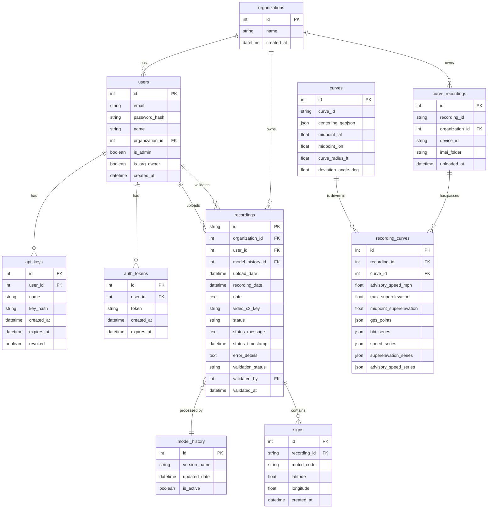

# Database Schema

This document outlines the complete database schema for the AWS Application, including a visual Entity-Relationship (ER) diagram, domain models, columns, and relationships. The application uses SQLAlchemy as the ORM, with SQLite serving as the database (as per local dev configs).

## Visual Entity-Relationship (ER) Diagram

---

## 1. Core Platform & Identity Models

### `organizations`
Represents a tenant or client organization in the system.
| Column | Type | Constraints | Description |
|--------|------|-------------|-------------|
| `id` | Integer | **Primary Key** | Unique organization ID |
| `name` | String | Unique, Not Null | Organization name |
| `created_at` | DateTime | Default `CURRENT_TIMESTAMP` | Timestamp of creation |

### `users`
Represents an individual user belonging to an organization.
| Column | Type | Constraints | Description |
|--------|------|-------------|-------------|
| `id` | Integer | **Primary Key** | Unique user ID |
| `email` | String | Unique, Not Null | User's email address |
| `password_hash` | String | Not Null | Hashed password |
| `name` | String | Not Null | User's full name |
| `organization_id` | Integer | **Foreign Key** (`organizations.id`), Not Null | The organization this user belongs to |
| `is_admin` | Boolean | Default `False` | Super-admin flag |
| `is_org_owner` | Boolean | Default `False` | Organization owner flag |
| `created_at` | DateTime | Default `CURRENT_TIMESTAMP` | Timestamp of creation |

### `api_keys`
API Keys for B2B API authentication.
| Column | Type | Constraints | Description |
|--------|------|-------------|-------------|
| `id` | Integer | **Primary Key** | Unique API key ID |
| `user_id` | Integer | **Foreign Key** (`users.id`), Not Null | Associated user |
| `name` | String | | Optional descriptive name |
| `key_hash` | String | Not Null | Hashed representation of the plain key |
| `created_at` | DateTime | Default `CURRENT_TIMESTAMP` | Timestamp of creation |
| `expires_at` | DateTime | | Optional expiration date |
| `revoked` | Boolean | Default `False` | Soft-delete / revocation flag |

### `auth_tokens`
Authentication tokens used by the mobile API.
| Column | Type | Constraints | Description |
|--------|------|-------------|-------------|
| `id` | Integer | **Primary Key** | Unique token ID |
| `user_id` | Integer | **Foreign Key** (`users.id`), Not Null | Associated user |
| `token` | String | Unique, Not Null | Token string (URL-safe base64) |
| `created_at` | DateTime | Default `CURRENT_TIMESTAMP` | Timestamp of creation |
| `expires_at` | DateTime | Not Null | Mandatory expiration date |

---

## 2. Traffic Sign Application Models

### `model_history`
Tracks the versioning and history of the ML Models used by the pipeline.
| Column | Type | Constraints | Description |
|--------|------|-------------|-------------|
| `id` | Integer | **Primary Key** | Unique model version ID |
| `version_name` | String | Not Null | Name/tag of the model |
| `updated_date` | DateTime | Default `CURRENT_TIMESTAMP` | Last updated timestamp |
| `is_active` | Boolean | Default `False` | Indicates if this is the currently active model |

### `recordings`
Tracks video recordings uploaded for sign extraction.
| Column | Type | Constraints | Description |
|--------|------|-------------|-------------|
| `id` | String | **Primary Key** | Custom ID format (e.g. `2024_05_20_23_32_53`) |
| `organization_id` | Integer | **Foreign Key** (`organizations.id`), Not Null | Owning organization |
| `user_id` | Integer | **Foreign Key** (`users.id`) | Uploader (nullable) |
| `model_history_id`| Integer | **Foreign Key** (`model_history.id`) | AI model used for processing |
| `upload_date` | DateTime | Default `CURRENT_TIMESTAMP` | When it was uploaded |
| `recording_date` | DateTime | | Extracted from the recording ID |
| `note` | Text | | Optional user notes |
| `video_s3_key` | String | | Location in AWS S3 |
| `status` | String | Default `'processing'` | Pipeline status |
| `status_message` | Text | | User-friendly status message |
| `status_timestamp`| DateTime | Default `CURRENT_TIMESTAMP` | Last status update |
| `error_details` | Text | | JSON string with pipeline error context |
| `validation_status`| String | Default `'to_be_validated'` | Status of manual validation |
| `validated_by` | Integer | **Foreign Key** (`users.id`) | Admin who validated it |
| `validated_at` | DateTime | | When validation occurred |

### `signs`
Detected traffic signs corresponding to a recording.
| Column | Type | Constraints | Description |
|--------|------|-------------|-------------|
| `id` | Integer | **Primary Key** | Unique sign ID |
| `recording_id` | String | **Foreign Key** (`recordings.id`, ON DELETE CASCADE), Not Null | Associated recording |
| `mutcd_code` | String | Not Null | Standardized traffic sign code |
| `latitude` | Float | Not Null | Sign GPS Latitude |
| `longitude` | Float | Not Null | Sign GPS Longitude |
| `created_at` | DateTime | Default `CURRENT_TIMESTAMP` | Database insertion time |

---

## 3. Curve Analytics Models

### `curve_recordings`
Recordings specifically gathered for curve analytics (distinct from sign app recordings).
| Column | Type | Constraints | Description |
|--------|------|-------------|-------------|
| `id` | Integer | **Primary Key** | Unique auto-increment ID |
| `recording_id` | String | Unique, Not Null, Indexed | External/string ID for the recording |
| `organization_id` | Integer | **Foreign Key** (`organizations.id`, ON DELETE CASCADE), Not Null | Owning organization |
| `device_id` | String | Not Null | Hardware device ID |
| `imei_folder` | String | Not Null | Hardware IMEI associated |
| `uploaded_at` | DateTime | Default `func.now()` | Upload timestamp |

### `curves`
Physical characteristics of a geometric road curve.
| Column | Type | Constraints | Description |
|--------|------|-------------|-------------|
| `id` | Integer | **Primary Key** | Unique DB ID |
| `curve_id` | String | Unique, Not Null, Indexed | External physical curve ID |
| `centerline_geojson`| JSON | Not Null | Geometric definition of the curve |
| `midpoint_lat` | Float | Not Null | GPS Latitude of curve midpoint |
| `midpoint_lon` | Float | Not Null | GPS Longitude of curve midpoint |
| `curve_radius_ft` | Float | | Measured radius of the curve in feet |
| `deviation_angle_deg`| Float | | Angle of deviation in degrees |

### `recording_curves`
Many-to-Many mapping table that stores analytics data for a specific pass (recording) through a specific physical curve.
| Column | Type | Constraints | Description |
|--------|------|-------------|-------------|
| `id` | Integer | **Primary Key** | Unique ID |
| `recording_id` | Integer | **Foreign Key** (`curve_recordings.id`, ON DELETE CASCADE), Not Null | The specific pass/recording |
| `curve_id` | Integer | **Foreign Key** (`curves.id`, ON DELETE CASCADE), Not Null | The physical curve |
| `advisory_speed_mph`| Float | | Calculated safe advisory speed |
| `max_superelevation`| Float | | Maximum bank/slope of the curve |
| `midpoint_superelevation`| Float | | Superelevation at the midpoint |
| `gps_points` | JSON | Not Null | Raw GPS trajectory |
| `bbi_series` | JSON | Not Null | Ball Bank Indicator data series |
| `speed_series` | JSON | Not Null | Vehicle speed series |
| `superelevation_series`| JSON | Not Null | Banking telemetry series |
| `advisory_speed_series`| JSON | Not Null | Calculated speed delta series |

*(Note: There is a `UniqueConstraint` on `(recording_id, curve_id)` to ensure each pass of a curve is only stored once).*
